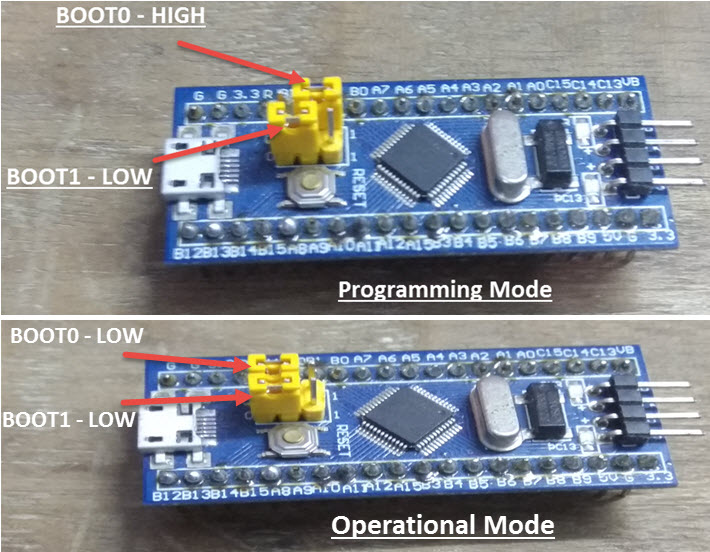
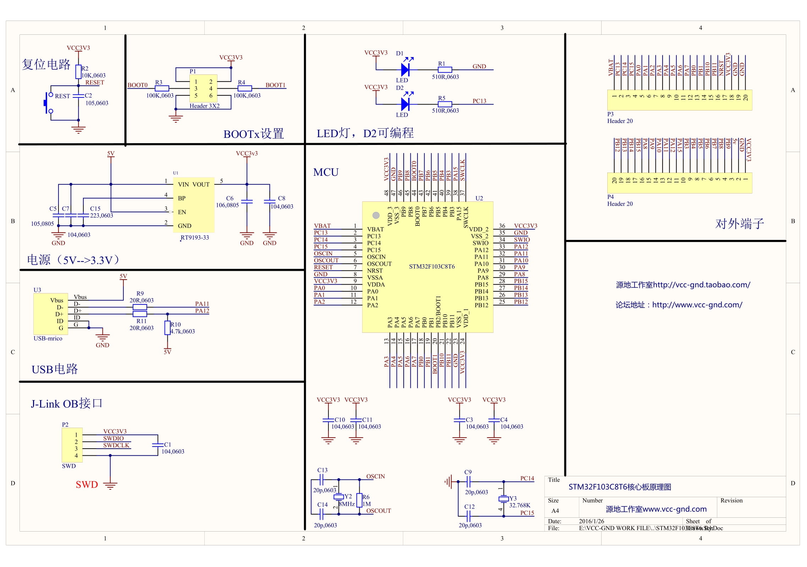

# Getting started with Zephyr RTOS on BluePill board

## Upload

### Using ST-LINK

There are several ways to upload the firmware to this board but the default way is to use the [ST-Link debugger](https://stm32-base.org/guides/connecting-your-debugger.html). 

In linux, you can use the following commands to install the ST-Link drivers:

```console
sudo apt -y install stlink-tools
sudo systemctl restart udev
```
Now you can `Upload` the firmware to the board using [PlaformIO](https://platformio.org/).

### Using USB Bootloader (DFU)

[DFU](https://github.com/devanlai/dapboot) is a simple USB bootloader that can be used to upload the firmware to the board without the need to any additional hardware (e.g. a programmer or debugger).



## Pinout


## Schematics



## Resources

- [Blue Pill - STM32F103C8T6](https://stm32-base.org/boards/STM32F103C8T6-Blue-Pill.html)
- [Getting Started with STM32F103C8T6 Blue Pill](https://www.electronicshub.org/getting-started-with-stm32f103c8t6-blue-pill/)
- [PlatformIO BluePill F103CB](https://docs.platformio.org/en/latest/boards/ststm32/bluepill_f103cb.html)
- [DFU Bootloader for STM32 chips](https://github.com/devanlai/dapboot)
- [Connecting ST-LINK debugger](https://stm32-base.org/guides/connecting-your-debugger.html)
- [How to fix PlatformIO STM32 Error: libusb_open() failed with LIBUSB_ERROR_ACCESS](https://techoverflow.net/2021/09/22/how-to-fix-platformio-stm32-error-libusb_open-failed-with-libusb_error_access/)
- [Zephyr for BluePill Documentation](https://docs.zephyrproject.org/2.6.0/boards/arm/stm32_min_dev/doc/index.html)
- [Zephyr Blinky Sample Application](https://github.com/zephyrproject-rtos/zephyr/blob/main/samples/basic/blinky/src/main.c)